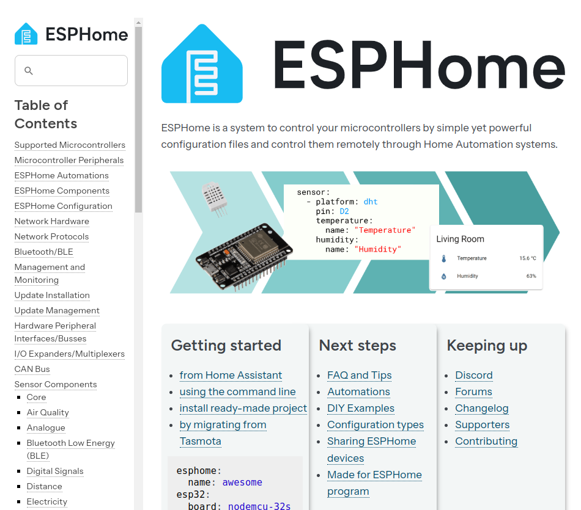

# Hello, IoT, world!
An Alarm Clock

## Overview

Here you will find software for an example embedded device, what some might call an - Internet of Things project. The device is an alarm clock, but the purpose is to show how software is designed.

The material here, including software to implement an alarm clock, shows how software is designed to mimic, model, or extend physical systems. The hardware used for the example is quite cheap, just a few pounds/euros/dollars, and easily obtained. In my implementation the alarm clock works in conjunction with the Home Assistant open source home automation system.

## Purpose of the alarm clock project

There are plenty of perfectly good alarm clocks, the world probably doesn't need any new designs. However, the concept of the alarm clock is a useful software design exercise.

But first, a quick aside.

### Hello, world!

Most programmers are familiar with the Hello World program, if you are not, take a look aSt Wikipedia <https://en.wikipedia.org/wiki/%22Hello,_World!%22_program>. 

Here's the Python hello world.

```python
print("Hello, world!")
```

This doesn't test your programming ability in the slightest, but it is an effective test of -

* target hardware - can it run a program and display output?
* compiler/interpreter tool chain - is the software required to edit, save, build and run a program installed and configured?  

### Blink!

Programmers working with embedded devices, for example wifi enabled motion switches and light-bulbs,  are often required to work with systems that have no operating system, and in many cases no text output, so printing "Hello, World" is not an option. Instead, they typically write a "blink" program that causes an LED to flash.

As with "Hello, World" a "Blink" program is useful to ensure that your "toolchain" is working correctly. That is, you are able to build and run software on a device.  However, it's so far from a real world problem that it doesn't test you, the programmer, or essential features such as wifi connectivity.

### What happens next?

Once you have determined that your device can "blink", you could -

* Build the 'thing' - maybe you know what you want to build.

* Build an example project - perhaps to test a feature of your device, a camera, temperature sensor, etc.

For decades the project I use to check that I can design and build a useful device is an alarm clock or similar, even the most basic of micro-controllers can run an alarm clock or kitchen timer program.

## What is an alarm clock?

I'm going to make the assumption that everyone knows what an alarm clock is, which is a key benefit of this recurring project - nothing needs to be invented, but everything needs to be designed.  (Humans are amazing at design, and terrible at invention).

### Origins of the alarm clock

I'm guessing you haven't given much thought to how alarm clocks came about, or what the internal components of a traditional alarm clock might be.

The alarm clock is a product of the industrial revolution, both for the need for workers to wake in time to get to work, and also for the technology to mass produce time keeping devices.

Traditional clockwork alarm clocks were not particularly good timekeeping devices, and would be set each night, often by checking with a wristwatch, and wound.

The clockwork motor powers both the clock mechanism and the alarm bell. Typically the act of winding also activates the alarm mechanism.

When the actual time reaches the alarm time the bell rings until the clockwork spring is fully unwound, or more usually until button on the top of the clock is pressed.

### The traditional user interface


### Digital alarm clocks

Today most alarm clocks are either electronic digital clocks, or a smartphone app. Even if the intention were not to emulate a traditional alarm clock, the components or sub-systems of such a device are going to be quite familiar.

* Power source

* Time setting

* Time keeping

* Alarm time setting

* Enable alarm

* Silence alarm

There is one further feature, but it is hidden from the user - check if current time is the alarm time, then activate the alarm.

### The hardware

Almost any MCU can do this job - Arduino, Micro:bit...



<hr>


